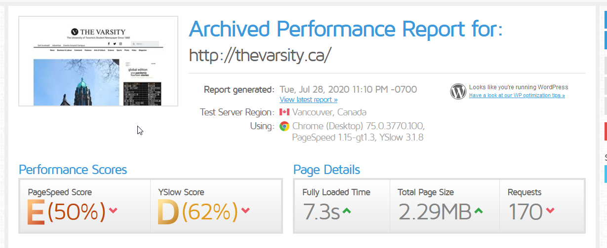
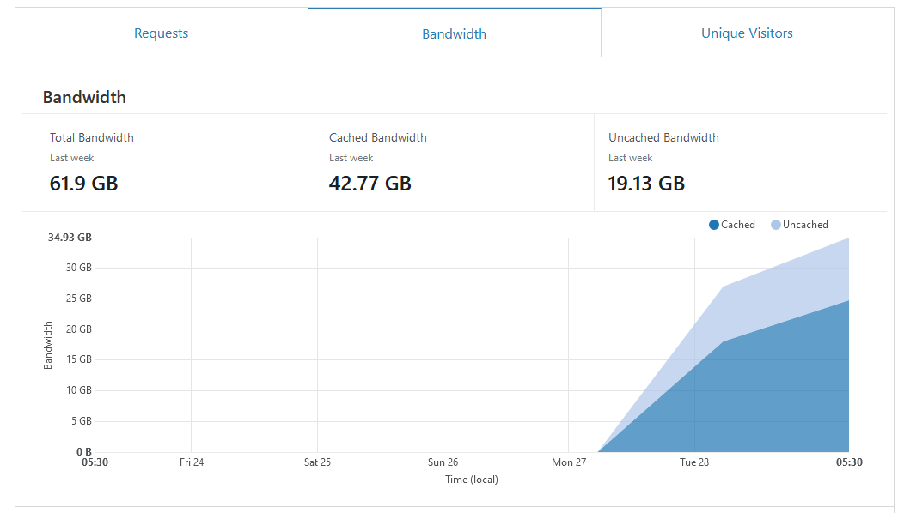
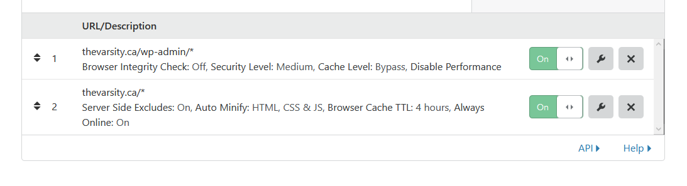

This post is all about optimization, but let me start by saying this is just the starting point of optimization you can go much further than this, and in the coming weeks I plan to do just that with The Varsity. But I want this blog to be a detailing of the process not just the final product, so let's talk about speed and how I've been obsessed with it for the past couple of days.

### Why just now you might ask?

 Well, since when I joined I wanted to get thevarsity.ca on Cloudflare but was not able to get the Authoritative nameservers to change to Cloudflare. This was especially complicated as no one at the varsity knew the domain registrar of the varsity.ca, after a lot of digging I finally found the registrar and set the Authoritative nameservers. Speaking of nameservers, we should definitely talk more about those but we'll save that for a later date.

# Before

The website's performance metrics before I started optimizing were pretty bad, the full report can be found [here](https://gtmetrix.com/reports/thevarsity.ca/Q4Ppkgy5)

or <https://gtmetrix.com/reports/thevarsity.ca/Q4Ppkgy5>

# After

After all the optimization I made in the past two days the test results look like this and the full report is [here](https://gtmetrix.com/reports/thevarsity.ca/lURxKxe8) or  <https://gtmetrix.com/reports/thevarsity.ca/lURxKxe8>

We will be analysing most of the errors in the report, and talking about how I resolved them or minimized them.

## Cloudflare

Now, cloudflare is truly amazing and they can do so much to improve your site but even just the basic caching is huge especially for a mostly static site like a newspaper. Let's look some numbers

In just two days after getting cloudflare setup it cached about 70% of our bandwidth that is a huge reduction of the load on our servers and massive speed boost for our users. 

Now why the bandwidth is so high in the first place is another discussion we will have later, and how I plan to minimize that.

## Setting Cloudflare up

So I would recommend messing with the cloudflare settings yourself to kind of learn what they do and you get to experiment, also when you mess up fun things happen.  For example, I know this was a horrible idea but I set the page rule for thevarsity to cache everything and store it for a month, I also set the cache to bypass the admin page and set the security level to high.
This did something extremely weird, which I think is pretty fun(also kind of dangerous), it first didn't allow my editor to login because of the security level, when I lowered it. The site for some reason cached my login, from India in a Canadian CDN and logged him in as me, well it let anyone join the landing page of the admin page as me. Thankfully there was nothing super confidential on the page, but this was a huge security vulnerability.
Finally, I did get the cloudflare wordpress plugin mainly for the cache to be automatically purged on update, but here are some of my other settings

These are page rules on top of the normal settings, but you should definitely mess with the settings yourself, I am planning to play with fire and mess with cloudflare's service workers in the future to speed up some tasks.
