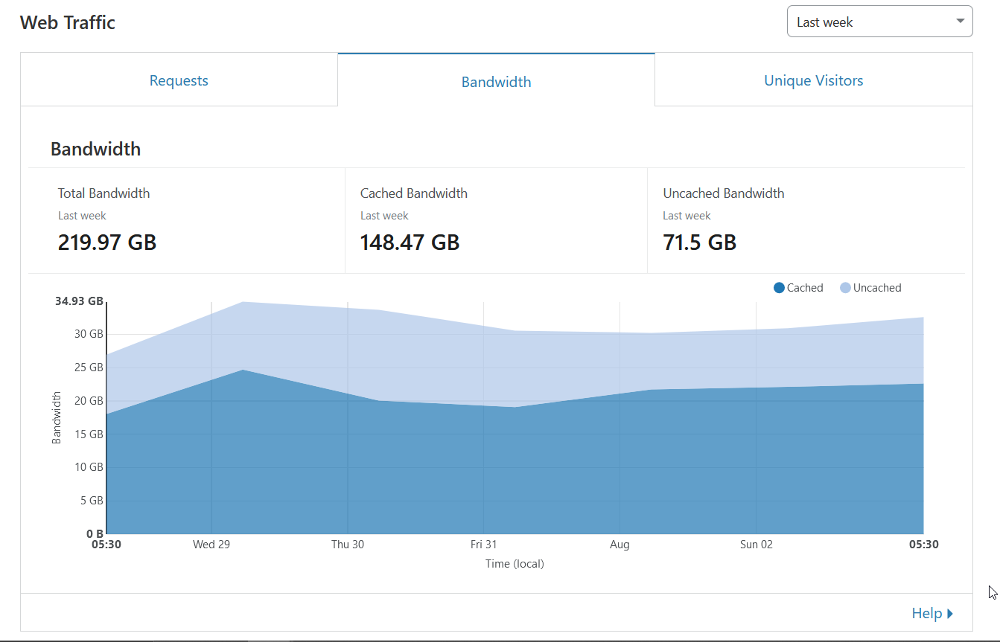
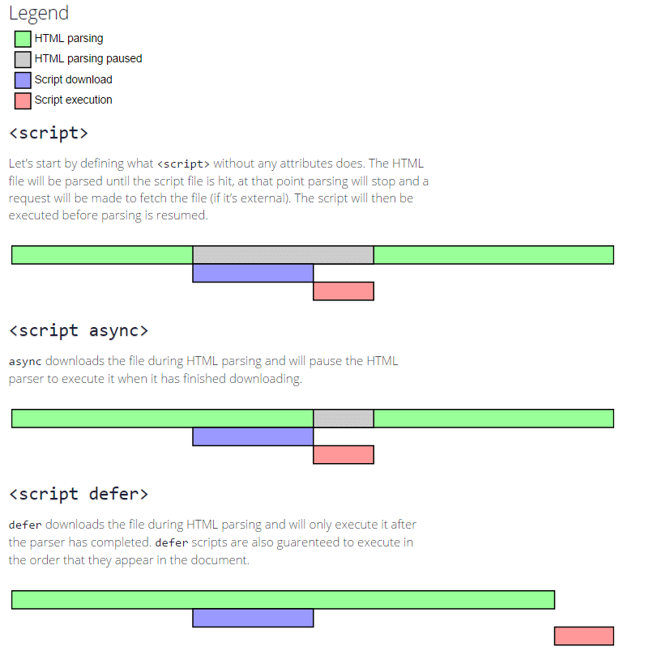
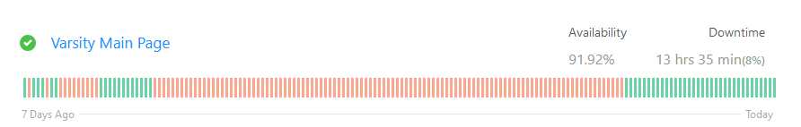
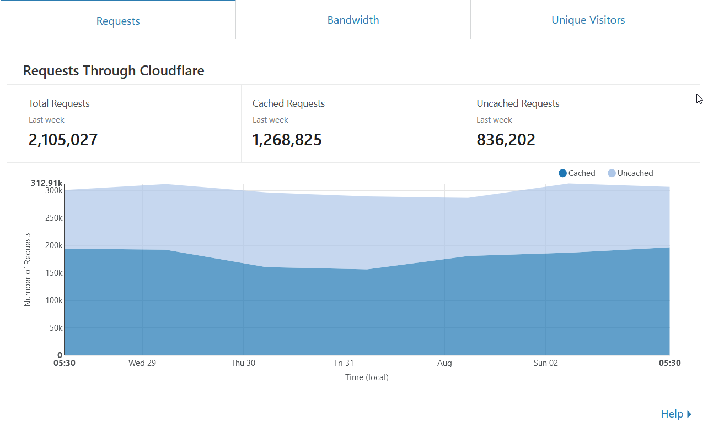
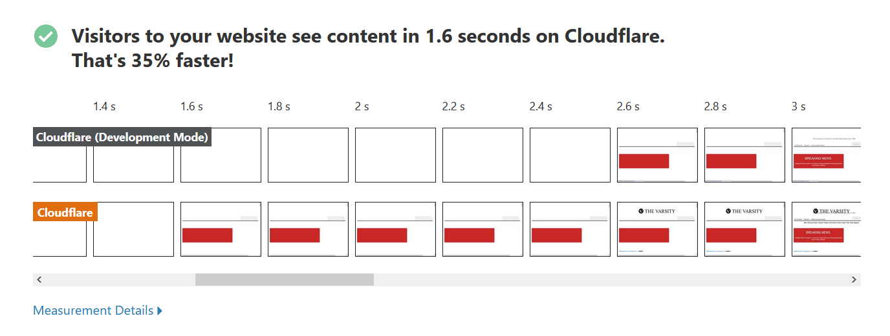
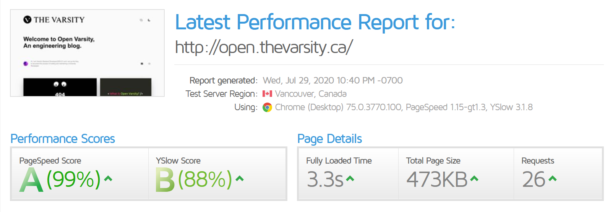

This post is all about optimization, but let me start by saying that this is just the starting point of optimization; you can go much further than this, and in the coming weeks I plan to do just that with *The Varsity*. But I want this blog to detail the process, not just the final product, so let’s talk about speed and how I’ve been obsessed with it for the past couple of days.

### Why now, you might ask?

Well, since when I joined I wanted to get thevarsity.ca on Cloudflare, but I was not able to get the authoritative nameservers to change to Cloudflare. This was especially complicated as no one at *The Varsity* knew the domain registrar of the varsity.ca. After a lot of digging I finally found the registrar and set the authoritative nameservers. Speaking of nameservers, we should definitely talk more about those, but we’ll save that for a later date.

## Testing

How do we measure performance? Mainly with two benchmarks; one being [GTmetrix](https://gtmetrix.com/) and the other [Google](https://developers.google.com/speed/pagespeed/insights/). These two benchmarks give a lot of valuable information about a website’s performance.

# Before

The website’s performance metrics before I started optimizing were pretty bad; the full report can be found [here.](https://gtmetrix.com/reports/thevarsity.ca/Q4Ppkgy5)

[](https://gtmetrix.com/reports/thevarsity.ca/Q4Ppkgy5)

# After

After all the optimization I made in **two days** the test results look like this, and the full report is [here.](https://gtmetrix.com/reports/thevarsity.ca/lURxKxe8)

[](https://gtmetrix.com/reports/thevarsity.ca/lURxKxe8)

We will be analyzing most of the errors in the report, and talking about how I resolved them or minimized them.

## Caching and Cloudflare

Now, Cloudflare is truly amazing and it can do so much to improve your site, but even just the basic caching is huge, especially for a mostly static site, like a newspaper. Let’s look some numbers.



Just one week after getting Cloudflare set up it cached about 70 per cent of our bandwidth. That is a huge reduction of the load on our servers and massive speed boost for our users.

Now, why the bandwidth was so high in the first place is another discussion we will have later, and how I plan to minimize that.

### Setting up Cloudflare

So I would recommend messing with the Cloudflare settings yourself to kind of learn what they do and experiment; also when you mess up fun things happen. For example, I know this was a horrible idea but I set the page rule for thevarsity.ca to cache everything and store it for a month. I also set the cache to bypass the admin page and set the security level to high.

This did something extremely weird, which I think is pretty funny (and also kind of dangerous). First, it didn’t allow my editor to log in because of the security level. When I lowered it, the site for some reason cached my login from India in a Canadian CDN and logged him in as me, and let anyone join the landing page of the admin page as me. Thankfully there was nothing super confidential on the page, but this was a huge security vulnerability.

Finally, I did get the Cloudflare WordPress plugin, mainly for the cache to be automatically purged on update, but here are some of my other settings.


These are page rules on top of the normal settings, but you should definitely mess with the settings yourself. I am planning to play with fire and mess with Cloudflare’s service workers in the future to speed up some tasks.

### More caching

We can do more than just Cloudflare to fully maximize our browser caching. For this, let’s look at <https://wordpress.org/plugins/speed-booster-pack/>, which helps enable control for browser caching directly in WordPress.

This plugin does a lot more and definitely worth your while to check out; it helps minify and optimize your code.

### Cookies

Another change I had made to improve the caching was handling cookies properly by setting the cookie domain as thevarsity.ca

```php
define("COOKIE_DOMAIN", "www.thevarsity.ca");
```

This had a consequence of not working properly with WordPress admin, which prevented our team from being able to access the website.

## Deferring JavaScript

Let’s briefly talk about the JavaScript Event loop, and why it is important to defer JavaScript or make it asynchronous.

There is this [amazing talk](https://www.youtube.com/watch?v=cCOL7MC4Pl0) about the event loop by Jake Archibald; I would really recommend it if you have the time. 

[](https://www.youtube.com/watch?v=cCOL7MC4Pl0)

Let’s quickly run it down. The left-hand side of the loop is the JavaScript execution and the ‘P’ on the right-hand side is the paint job, where we paint the page.

So if we have too much JavaScript execution in a blocking manner on the main thread, **the painting cannot happen**. This has an effect on the user experience, especially the first paint job, which is when the users finally see the page.

This graphic from https://kinsta.com/blog/defer-parsing-of-javascript/ will help explain better

[](https://kinsta.com/blog/defer-parsing-of-javascript/)

With WordPress, especially a plugin like Elementor, which is what *The Varsity* uses, all of the JavaScript execution happens synchronously on the main thread. **Why this is the default setting is beyond me.**

But the great thing about WordPress is that at this scale, most issues you face are already solved for you, so  it’s just about finding the right plugin.

A great plugin is <https://wordpress.org/plugins/async-javascript/>, which helps you easily defer all your JavaScript code.

This was a huge problem for *The Varsity* website’s performance, as it has a lot of DOM elements and a lot of JavaScript because of Elementor. This resulted in a really long time before the first paint job.

## Images

*The Varsity* has a lot of images, and really high resolution images. We actually store tens of gigabytes of images on our servers, and this can really slow down a site.

**How can we fix this?**

There are two primary ways to mitigate this problem:

1. Compress the images
2. Optimize the way they are loaded

Let’s start with the second method, because it is easier.

### Loading images

This blog is amazing at loading images because of [gatsby-image](https://www.gatsbyjs.org/packages/gatsby-image/). This plugin for Gatsby helps lazy load the image and optimize it by blurring it before it can fully load.

We want something similar to gatsby-image for WordPress, and we can use the [lazy loading plugin](https://wordpress.org/plugins/wp-lazy-loading/) from the WordPress Team; this helps us experiment with lazy loading images.

Now when the website loads, we don’t load all the images at once. Rather, we load them as the user scrolls to see them.

### Compressing Images

To start this topic out, I would recommend another great [Jake Archibald talk about image compression](https://www.youtube.com/watch?v=F1kYBnY6mwg).

The idea here is that you can reduce a lot of the detail of an image and most people will not be able to notice the difference. Let me give you an example.

Notice any differences between the two images below?


One of these images has **0.3 per cent the colour data** of the other image.

To clarify, they both have the same brightness data, but one has 0.3 per cent of the colour data of the other.

You can experiment yourself with very basic compression [here.](https://jakearchibald.github.io/image-experiments/channels/)

Unfortunately, *The Varsity* has thousands of images over the last 20 years on our servers, and we couldn’t possibly do this manually.

I am planning to use Short Pixel Image Optimizer; it can automatically optimize images and even generate WebP files. It also gave *The Varsity* 15,000 credits for being a non-governmental organization.

The number of requests *The Varsity* handles, plus the size of these images is what leads to the huge bandwidth on our servers.

## Memory

A consequence of these performance changes is an increase in memory usage; this is a factor I did not consider.

As a result, *The Varsity* has this weird bug where it would have a 500 error but fix itself on a reload. We had these mini crashes hundreds of times a day and it significantly increased the downtime of our service.

In the last week, we had many such incident all last from one to minutes, but this resulted in a total downtime of 13 hours.



The last stretch of 100 per cent uptime was after fixing the memory issue, which was super easy.

```php
define('WP_MEMORY_LIMIT', '64M');

/** Absolute path to the WordPress directory. */
if ( ! defined( 'ABSPATH' ) )
        define( 'ABSPATH', dirname( __FILE__ ) . '/' );

/** Sets up WordPress vars and included files. */
require_once ABSPATH . 'wp-settings.php';
@ini_set( 'memory_limit', '64M' );
```

# Let’s see some numbers

In one week, *The Varsity* handles a lot of requests



By caching a little more than half of them using Cloudflare and browser caching, we are able to cut our server load in half.

At the top we saw a two second reduction in full page load, but let’s look at first paint job time.



Here we see an reduction in about one full second, which is has a large impact on the users perceived speed of the site.

# Room for improvement

As seen in the beginning, the main site is still not at 100 per cent, which clearly shows that there’s room for improvement; further optimization can happen to increase the overall performance.

The response of the site is quite bad, at an average of 800 milliseconds; we want to reduce that significantly.

A good overall performance target is something like this blog site. Because of Gatsby, its performance is incredible.


